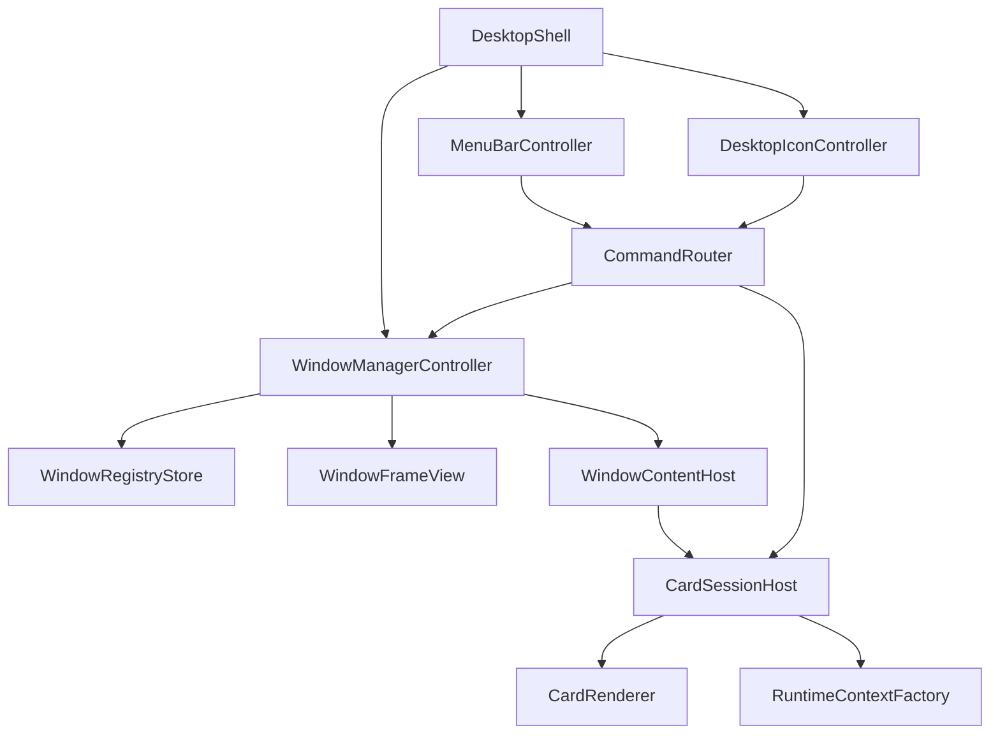
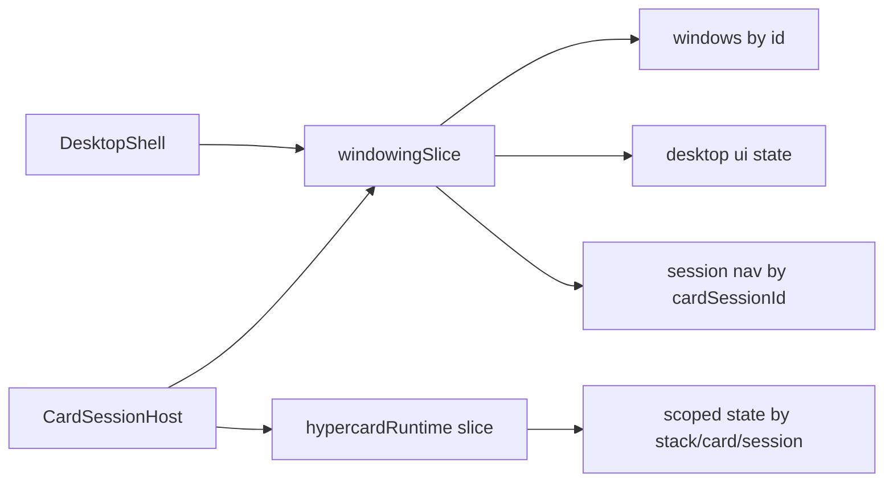
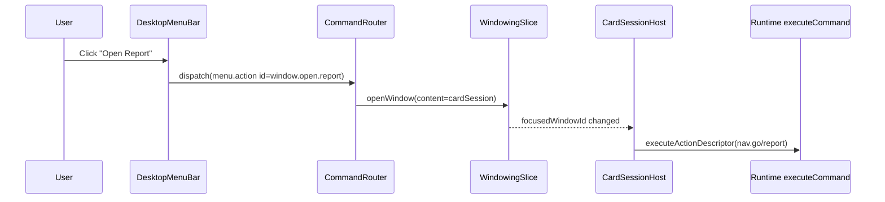

# Windowing Container Framework Study

## Executive Summary

This document studies `ttmp/2026/02/15/HC-029-WINDOWING-SUPPORT--windowing-support-for-multiple-hypercard-cards/sources/local/mac1-windowing.jsx` in depth and proposes a framework-grade extraction for three core concerns:

1. Window manager primitives (open/focus/close/move/resize/layering)
2. Desktop shell primitives (menu bar, desktop icons, launch points)
3. HyperCard integration primitives (rendering multiple card sessions, command routing, state isolation)

The imported example is strong as a behavioral prototype, especially around interaction feel and UI affordances (`MacWindow`, `MenuBar`, `openWin`, `focus`, `drag`, `resize`). It is not yet framework-ready because state ownership is centralized in a single React component and modeled as untyped ad hoc objects. The current engine shell is also not yet multi-window ready because runtime and navigation are single-session oriented (`packages/engine/src/components/shell/HyperCardShell.tsx`, `packages/engine/src/features/navigation/navigationSlice.ts`).

The recommendation is a staged architecture:

- Stage A (low risk): Desktop shell + one card per window, one instance per card id
- Stage B (core capability): per-window navigation stack + window-targeted action routing
- Stage C (full capability): duplicate card instances with isolated runtime scope using `cardSessionId`

This design preserves existing DSL/action contracts while adding a composable windowing subsystem. It also defines a widget/component system, UX rules, pseudocode, and rollout plan suitable for implementation in `packages/engine`.

## Problem Statement

HyperCard currently renders one active card session at a time in a single frame (`WindowChrome` + `CardRenderer`). Many workflows require side-by-side card work:

- Compare list/detail cards simultaneously
- Keep assistant or report card open while editing forms
- Build dashboard-like working sets per task

Today this is blocked by architecture:

- `HyperCardShell` computes one `currentCardId` and one runtime context (`packages/engine/src/components/shell/HyperCardShell.tsx:99-316`)
- Navigation state keeps one stack (`packages/engine/src/features/navigation/navigationSlice.ts:10-44`)
- Runtime scoped state keying assumes one `cardId` instance per stack (`packages/engine/src/cards/runtimeStateSlice.ts`)

A windowed container must support multiple concurrent card sessions, independent focus/z-order, and a clear desktop command model without breaking existing card DSLs.

## Source Archeology: What To Extract From mac1-windowing.jsx

### 1. Window manager mechanics (strong extraction target)

Key symbols:

- `MacWindow` (`mac1-windowing.jsx:328`)
- `handleTitleDrag` (`mac1-windowing.jsx:329-335`)
- `handleResize` (`mac1-windowing.jsx:337-343`)
- `openWin` (`mac1-windowing.jsx:446-457`)
- `focus` (`mac1-windowing.jsx:484`)
- `close` (`mac1-windowing.jsx:485`)
- `drag` (`mac1-windowing.jsx:486`)
- `resize` (`mac1-windowing.jsx:487`)

Reusable patterns:

- Title-bar drag using global mouse listeners
- Resize handle with min constraints (`180x100`)
- Z-order bump-on-focus
- Re-open dedupe by title (`openWin` lookup)

Framework gap:

- No typed window schema
- `zCtr` + nested `setState` composition can race under high event throughput
- `isActive ? 100 : win.z` special-case in render (`mac1-windowing.jsx:350`) hard-codes top layer

### 2. Menu bar model (medium extraction target)

Key symbols:

- `MENU_ITEMS` (`mac1-windowing.jsx:3-9`)
- `MenuBar` (`mac1-windowing.jsx:400-425`)
- `handleMenu` (`mac1-windowing.jsx:489-499`)

Reusable patterns:

- Menu sections with separators (`---`)
- Item click closes menu and dispatches action
- Contextual app launching from command labels

Framework gap:

- Labels are command ids (not stable command keys)
- No command namespace or capability checks
- No keyboard shortcuts / no disabled state model

### 3. Desktop icon launcher model (high extraction target)

Key symbols:

- `DESKTOP_ICONS` (`mac1-windowing.jsx:11-17`)
- `handleIconDbl` (`mac1-windowing.jsx:501-511`)
- Desktop icon render (`mac1-windowing.jsx:550-557`)

Reusable patterns:

- Single click selection, double click open
- Desktop icon metadata (`id`, `label`, `emoji`)
- Folder/content mapping to window payloads

Framework gap:

- No abstraction between icon and command
- No persisted icon positions
- No accessibility path for non-mouse open

### 4. App/content registry model (partial extraction target)

Key symbols:

- `openApp` and `cfgs` map (`mac1-windowing.jsx:459-474`)
- `handleItemOpen` folder map (`mac1-windowing.jsx:476-482`)

Reusable patterns:

- Registry-driven open behavior
- Metadata + render payload separation potential

Framework gap:

- `appContent` stores instantiated React nodes directly
- Hard to serialize/persist/restore
- No lazy loading boundary

## Current Engine Constraints and Extension Points

### Single-session shell assumptions

`HyperCardShell` resolves one card and one runtime loop:

- `currentCardId` from current nav (`HyperCardShell.tsx:99`)
- one `CardRenderer` instance (`HyperCardShell.tsx:315`)
- one nav stack depth (`HyperCardShell.tsx:93`)

### Navigation architecture

`navigationSlice` state:

- `layout` + `stack[]` + `homeCard` (`navigationSlice.ts:10-20`)
- actions mutate one stack (`navigationSlice.ts:27-44`)

### Runtime state architecture

Runtime state keyed by `stackId` and `cardId` (`runtimeStateSlice.ts`).
This is sufficient for one instance per card id but not for opening duplicate card windows with isolated state.

### Styling/parts architecture

The existing part registry (`packages/engine/src/parts.ts`) and CSS token model (`packages/engine/src/theme/base.css`) are strong foundations for introducing windowing parts without breaking existing theming.

## Proposed Framework Architecture

### Layered model



### New conceptual entities

- `DesktopSession`: top-level shell state (active menu, selected icon, focused window)
- `WindowInstance`: geometry + z-order + content descriptor + session refs
- `CardSession`: per-window card navigation/runtime context
- `WindowCommand`: stable command id + payload, not label string

### Proposed file/module layout

```text
packages/engine/src/features/windowing/
  windowingSlice.ts
  windowingSelectors.ts
  commandRegistry.ts

packages/engine/src/components/shell/windowing/
  DesktopShell.tsx
  DesktopMenuBar.tsx
  DesktopIconLayer.tsx
  WindowSurface.tsx
  WindowTitleBar.tsx
  WindowContentHost.tsx
  WindowResizeHandle.tsx

packages/engine/src/components/shell/
  HyperCardDesktopShell.tsx        # new multi-window shell
  HyperCardShell.tsx               # remains backward-compatible single-window shell
```

## Data Model Proposal

### Window schema (TypeScript)

```ts
export type WindowContentKind = 'card' | 'app' | 'dialog';

export interface WindowBounds {
  x: number;
  y: number;
  w: number;
  h: number;
}

export interface CardSessionRef {
  stackId: string;
  cardId: string;
  param?: string;
  cardSessionId: string; // enables duplicate card windows later
}

export interface WindowInstance {
  id: string;
  title: string;
  icon?: string;
  bounds: WindowBounds;
  z: number;
  minW: number;
  minH: number;
  isDialog?: boolean;
  isResizable?: boolean;
  isMinimized?: boolean;
  content: {
    kind: WindowContentKind;
    card?: CardSessionRef;
    appKey?: string;
    dialogKey?: string;
  };
}
```

### Desktop/menu schema

```ts
export interface DesktopIconSpec {
  id: string;
  label: string;
  icon: string;
  command: WindowCommand;
  position?: { x: number; y: number };
}

export interface MenuAction {
  id: string;            // stable command id: 'window.close', 'nav.back'
  label: string;         // render label
  shortcut?: string;     // optional visual shortcut
  enabled?: boolean;
}

export interface MenuSection {
  id: string;
  title: string;
  actions: Array<MenuAction | { separator: true }>;
}
```

## Action/Navigation Integration Strategy

### Core design decision

Do not overload existing single `navigation.stack` for desktop windows. Keep it intact for backward compatibility and add a dedicated windowing state domain.

### New state slice sketch

```ts
interface WindowingState {
  desktop: {
    activeMenuId: string | null;
    selectedIconId: string | null;
    focusedWindowId: string | null;
    zCounter: number;
  };
  windows: Record<string, WindowInstance>;
  order: string[]; // stable render order for deterministic paint
  sessions: Record<string, { nav: NavEntry[] }>; // keyed by cardSessionId
}
```

### Command routing

- Menu and icons emit `WindowCommand` (stable id, typed args)
- Router resolves target:
  - desktop-level (open/focus/arrange)
  - window-level (close/minimize)
  - card-session level (nav.go/nav.back within targeted window)

### Compatibility mode

`HyperCardShell` keeps existing API.
`HyperCardDesktopShell` introduces windowing API.
A thin adapter can map old `navShortcuts` into desktop icon/menu specs for migration.

## Window Manager Behavior Contract

### Required interactions

- Focus on pointer-down
- Drag from title bar
- Resize from lower-right handle
- Close from chrome action
- Optional: minimize/maximize/tile

### Pseudocode: open/focus semantics

```ts
function openWindow(spec: OpenWindowSpec): string {
  const existing = findOpenWindowByDedupeKey(spec.dedupeKey);
  if (existing) {
    focusWindow(existing.id);
    return existing.id;
  }

  const id = createWindowId();
  const z = nextZ();
  state.windows[id] = {
    id,
    title: spec.title,
    icon: spec.icon,
    bounds: withClamp(spec.bounds ?? defaultBounds()),
    z,
    minW: spec.minW ?? 240,
    minH: spec.minH ?? 160,
    content: spec.content,
  };
  state.order.push(id);
  state.desktop.focusedWindowId = id;
  return id;
}

function focusWindow(id: string): void {
  if (!state.windows[id]) return;
  state.windows[id].z = nextZ();
  state.desktop.focusedWindowId = id;
}
```

### Pseudocode: drag/resize reducer + pointer controller split

```ts
// Pointer controller (component)
onTitlePointerDown(winId, startEvent) {
  capturePointer(startEvent.pointerId);
  const start = getBounds(winId);
  pointerSession = { mode: 'drag', winId, anchor: { x: startEvent.clientX - start.x, y: startEvent.clientY - start.y } };
}

onPointerMove(ev) {
  if (!pointerSession) return;
  if (pointerSession.mode === 'drag') {
    dispatch(windowMoved({ id: pointerSession.winId, x: ev.clientX - pointerSession.anchor.x, y: ev.clientY - pointerSession.anchor.y }));
  }
  if (pointerSession.mode === 'resize') {
    dispatch(windowResized({ id: pointerSession.winId, w: max(minW, ...), h: max(minH, ...) }));
  }
}
```

## Menu Bar Extraction Design

### What to reuse

From `mac1-windowing.jsx:3-9` and `:400-425`:

- Structured top-level sections
- Dropdown activation model
- auto-close on action execute

### What to redesign

- Replace string actions with `id`
- Add `enabled`, `checked`, `shortcut`
- Add command scoping: desktop vs focused window vs all windows

### Example menu contract

```ts
const menuSections: MenuSection[] = [
  {
    id: 'app',
    title: 'App',
    actions: [
      { id: 'app.about', label: 'About HyperCard Desktop' },
      { separator: true },
      { id: 'window.new.home', label: 'New Home Window', shortcut: 'Ctrl+N' },
      { id: 'app.quit', label: 'Close Desktop Session' },
    ],
  },
  {
    id: 'window',
    title: 'Window',
    actions: [
      { id: 'window.closeFocused', label: 'Close Window', shortcut: 'Ctrl+W' },
      { id: 'window.tile', label: 'Tile Windows' },
      { id: 'window.cascade', label: 'Cascade Windows' },
    ],
  },
];
```

## Desktop Icon Extraction Design

### What to reuse

From `DESKTOP_ICONS` and desktop render (`mac1-windowing.jsx:11-17`, `:550-557`):

- explicit metadata-driven icon definitions
- single select + double-open interaction

### What to redesign

- Each icon maps to typed command
- keyboard navigation support
- persisted position and viewport clamping

### Icon interaction contract

- Click: set `selectedIconId`
- Enter: run icon command
- Double click: run icon command
- Escape: clear selection

## Widget Component System Proposal

The goal is a composable windowing kit, not one giant shell component.

### Core components

1. `DesktopShell`
- Hosts menu bar, icon layer, window layer, and overlays

2. `DesktopMenuBar`
- Receives `MenuSection[]`, `activeMenuId`, and dispatch callback

3. `DesktopIconLayer`
- Renders icons from `DesktopIconSpec[]`
- Handles selection/open semantics

4. `WindowLayer`
- Renders windows sorted by z

5. `WindowSurface`
- Frame + chrome + focus semantics

6. `WindowTitleBar`
- Title, icon, controls, drag handle

7. `WindowContentHost`
- Resolves content kind and renders card/app/dialog host

8. `CardSessionHost`
- Creates per-window runtime context and renders `CardRenderer`

9. `WindowResizeHandle`
- Dedicated pointer behavior to keep `WindowSurface` simple

### Part tokens to add (`parts.ts` + CSS)

```ts
windowDesktop
windowLayer
windowSurface
windowTitleBar
windowTitleText
windowControl
windowContent
windowResizeHandle
desktopMenuBar
desktopMenuItem
desktopMenuDropdown
desktopIcon
desktopIconLabel
```

### Why this split

- testability: reducer logic isolated from pointer logic
- theming: parts map cleanly to CSS token overrides
- extensibility: app teams can swap menu or icon layer independently

## UX Design Guidelines

### Focus and discoverability

- Always show clear active-window affordance (title contrast)
- Clicking any window region should focus it
- Menu commands target focused window by default

### Motion and interaction feel

- Drag should not stutter under high-frequency pointermove
- Optional: requestAnimationFrame throttling for resize/drag dispatch
- Use visual bounds hints when nearing viewport edges

### Keyboard interactions

Minimum keyboard set:

- `Ctrl+N`: open default window
- `Ctrl+W`: close focused window
- `Ctrl+Tab`: cycle focus
- `Alt+F`: open first menu
- `Esc`: close active menu/clear icon selection

### Accessibility

- Menu bar: role `menubar` / `menu` / `menuitem`
- Windows: labeled regions with focus semantics
- Icons: keyboard-reachable buttons, not div-only handlers

### Mobile/tablet fallback

Desktop windowing on narrow viewports should degrade to card-switching tabs or stacked sheets.
Do not force freeform desktop drag interactions on touch-first phones.

## Screenshot Sketches (Wireframes)

### Sketch A: Desktop baseline

```text
+--------------------------------------------------------------------------------+
| App  File  Edit  View  Window                                  10:42          |
+--------------------------------------------------------------------------------+
|                                                                                |
|                                     [Icon] Inventory                           |
|                                     [Icon] CRM                                 |
|                                     [Icon] Reports                             |
|                                                                                |
|        +-----------------------------------------------+                       |
|        | [x]  Inventory - Browse                       |                       |
|        +-----------------------------------------------+                       |
|        | Filters...                                    |                       |
|        |                                               |                       |
|        | Table rows                                    |                       |
|        |                                               |                       |
|        +-------------------------------------------+---+                       |
|                                                    |///|                       |
+--------------------------------------------------------------------------------+
```

### Sketch B: Multi-window working set

```text
+--------------------------------------------------------------------------------+
| App  File  Edit  View  Window                                                  |
+--------------------------------------------------------------------------------+
|  +--------------------------------------+                                      |
|  | [x] Item Detail                      |   +-------------------------------+  |
|  +--------------------------------------+   | [x] Assistant                 |  |
|  | SKU: A-1002                          |   +-------------------------------+  |
|  | Name: Thermal Bottle                 |   | chat timeline...              |  |
|  | Qty: 2                               |   | prompt input...               |  |
|  | [Save] [Sell 1] [Receive +5]         |   +-------------------------------+  |
|  +--------------------------------------+                                      |
|                                                                                |
|                           +-----------------------------------------+          |
|                           | [x] Low Stock                           |          |
|                           +-----------------------------------------+          |
|                           | list/table                              |          |
|                           +-----------------------------------------+          |
+--------------------------------------------------------------------------------+
```

### Sketch C: Narrow viewport fallback

```text
+------------------------------------------+
| [Window Tabs] Detail | List | Assistant  |
+------------------------------------------+
| Active panel content                     |
| (single visible session)                 |
|                                          |
+------------------------------------------+
| Bottom actions: New | Close | Switch     |
+------------------------------------------+
```

## State and Event Flow Diagrams

### State ownership diagram



### Interaction flow: menu command to focused card



## Pseudocode for HyperCard Integration

### CardSessionHost (core bridge)

```ts
function CardSessionHost({ windowId }: { windowId: string }) {
  const win = useWindow(windowId);
  const session = useSession(win.content.card!.cardSessionId);

  const current = session.nav[session.nav.length - 1] ?? { card: stack.homeCard };
  const cardDef = stack.cards[current.card];

  const runtime = makeRuntimeForSession({
    stack,
    cardDef,
    cardSessionId: session.id,
    params: { card: current.card, param: current.param ?? '' },
    nav: {
      go: (card, param) => dispatch(windowNavGo({ windowId, card, param })),
      back: () => dispatch(windowNavBack({ windowId })),
    },
  });

  return <CardRenderer cardId={session.cardRenderId} cardDef={cardDef} runtime={runtime} />;
}
```

### Session-aware runtime keying

```ts
// Option A: augment runtime keys with cardSessionId.
// Option B: derive synthetic cardId = `${cardId}::${cardSessionId}`.

ensureCardRuntime({
  stackId,
  cardId: deriveRuntimeCardId(cardId, cardSessionId),
  cardType,
  backgroundId,
  defaults,
});
```

## Design Decisions

1. Keep current `HyperCardShell` unchanged for compatibility.
Rationale: avoids forcing all apps to migrate immediately.

2. Add `HyperCardDesktopShell` as an opt-in path.
Rationale: isolates complexity and allows phased hardening.

3. Use command ids instead of string labels in menu/icon systems.
Rationale: stable routing, localization-safe, testable.

4. Introduce `cardSessionId` for eventual duplicate card windows.
Rationale: avoids runtime state collisions.

5. Split pointer controllers from reducers.
Rationale: lower bug rate and cleaner test coverage.

## Alternatives Considered

### Alternative A: Hack multi-window into existing `navigation.stack`

Rejected. This would force window semantics into history semantics and quickly become unmaintainable.

### Alternative B: Keep one runtime session and just visually clone cards

Rejected. Visual cloning without state isolation creates nondeterministic behavior, especially for forms and local scoped state.

### Alternative C: Full rewrite of shell + runtime in one ticket

Rejected for risk. The staged approach gives measurable value earlier and reduces rollback cost.

## Risks and Mitigations

1. Risk: runtime state collision when opening duplicate cards.
Mitigation: `cardSessionId` + synthetic runtime keys from Stage B onward.

2. Risk: drag/resize jank in React event loops.
Mitigation: pointer capture + RAF batching + reducer-only geometry writes.

3. Risk: command ambiguity across desktop/window/card scopes.
Mitigation: explicit command namespace and typed router tables.

4. Risk: keyboard/a11y regressions.
Mitigation: include accessibility contract in component acceptance tests.

## Implementation Plan

### Phase 1: Windowing foundation

- Add `windowingSlice` with open/focus/close/move/resize reducers
- Build `WindowSurface`, `WindowTitleBar`, `WindowResizeHandle`
- Render static non-card windows in a prototype `DesktopShell`

Deliverable: movable/resizable/focusable windows with deterministic z-order.

### Phase 2: Desktop shell primitives

- Build `DesktopMenuBar` with command ids
- Build `DesktopIconLayer` with selection + open actions
- Add command router with desktop/window target semantics

Deliverable: menu and icon launched windows with tested command routing.

### Phase 3: HyperCard session host

- Create `CardSessionHost` bridging to `CardRenderer`
- Add per-window nav stack in `windowingSlice`
- Route `nav.go`/`nav.back` per focused window

Deliverable: multiple card windows open concurrently (one instance per card id allowed).

### Phase 4: Duplicate-card isolation

- Add `cardSessionId` runtime key strategy
- Update runtime context creation and selectors as needed
- Add tests for two windows showing same card with independent local state

Deliverable: full multi-instance card windows.

### Phase 5: UX polish and fallback

- keyboard map, focus ring polish, tiling commands
- mobile/narrow viewport fallback behavior
- storybook scenarios for 1/2/5 windows

Deliverable: production-ready UX and documentation.

## Test Strategy

### Unit tests

- `windowingSlice` reducers: open/focus/close/geometry constraints
- command router: menu/icon command targeting
- session nav reducers: per-window `nav.go` and `nav.back`

### Integration tests

- Open 3 windows, verify z-order after focus changes
- Open same card twice, verify state isolation (post-Phase 4)
- Close focused window and ensure focus handoff is deterministic

### Storybook scenarios

- Desktop idle with icons only
- Two overlapping windows
- High-density (6 windows) stress story
- Narrow viewport fallback story

## UX Deep Dive

### Primary user workflows to optimize

1. Compare + edit workflow
- User opens `browse`, `itemDetail`, and `assistant` windows.
- They keep `browse` as discovery context, `itemDetail` as edit target, and `assistant` for guidance.
- System requirement: `itemDetail` cannot lose unsaved local edits when user focuses other windows.

2. Monitoring workflow
- User keeps a low-stock report open while entering receive-shipment forms.
- System requirement: fast focus switching and clear active-window affordance.
- Secondary requirement: toast and alerts should indicate target window context.

3. Command-first workflow
- User uses menu and keyboard more than icons.
- System requirement: command routing must be predictable and discoverable.
- Example: `Ctrl+W` closes focused window, never background windows.

### UX invariants

These must remain true in every implementation phase:

- Invariant A: exactly one focused window at a time when at least one window is open.
- Invariant B: every menu action has a deterministic target domain.
- Invariant C: close actions are reversible until persisted side effects occur.
- Invariant D: pointer interactions and keyboard interactions produce equivalent command paths.

### Window affordance decisions

1. Active title treatment
- Active window title should use stronger contrast and optional pattern fill.
- Inactive windows should remain readable but visually secondary.

2. Resize affordance
- Use explicit resize handle in lower-right corner.
- Cursor and hit target size must remain usable at low zoom.

3. Drag thresholds
- Ignore tiny pointer jitter before drag starts (2-4px threshold).
- Prevent accidental drags when double-clicking title bars.

4. Viewport clamping
- Windows should not be dragged fully off-screen.
- Keep at least title bar and 16px content edge visible.

### Icon UX decisions

1. Selection behavior
- Single click selects icon, second click or Enter opens.
- Desktop click on empty area clears icon selection.

2. Naming behavior
- Label truncation with tooltip on overflow.
- Stable icon ids for persistence and sync.

3. Desktop density behavior
- At high icon counts, allow grid scroll or paged icon areas.
- Preserve keyboard reachability independent of scroll position.

### Menu UX decisions

1. Top-level menu behavior
- Click toggles menu open/close.
- Escape closes current menu and returns focus to last focused window.

2. Dropdown behavior
- Hover may preview item highlight, but action still requires explicit click or Enter.
- Disabled items must be visible but not interactive.

3. Shortcut rendering
- Render shortcut hints in right-aligned column.
- Do not rely on shortcut text for command dispatch identity.

### Error and recovery UX

1. Failed window open
- Show toast: `Could not open card window`.
- Keep menu open only if failure is recoverable by immediate alternate choice.

2. Missing card id
- Open fallback dialog with actionable diagnostics in debug mode.
- In production mode, open home card and show non-blocking toast.

3. Runtime action errors
- Surface error with target window title and action id.
- Keep session state intact when possible.

## Detailed Widget API Sketches

### `DesktopShell`

```ts
interface DesktopShellProps {
  menus: MenuSection[];
  icons: DesktopIconSpec[];
  windows: WindowInstance[];
  focusedWindowId: string | null;
  activeMenuId: string | null;
  selectedIconId: string | null;
  onCommand: (cmd: WindowCommand) => void;
  onWindowCommand: (id: string, cmd: WindowCommand) => void;
}
```

Responsibilities:

- coordinate layout layers and z-order rendering
- normalize click-away behavior (clear icon selection, close menus)
- avoid embedding business logic in render body

### `WindowSurface`

```ts
interface WindowSurfaceProps {
  win: WindowInstance;
  focused: boolean;
  children: React.ReactNode;
  onFocus: () => void;
  onClose: () => void;
  onMove: (next: { x: number; y: number }) => void;
  onResize: (next: { w: number; h: number }) => void;
}
```

Responsibilities:

- pointer interactions only
- no routing and no content resolution
- no awareness of card DSL/runtime internals

### `WindowContentHost`

```ts
interface WindowContentHostProps {
  win: WindowInstance;
  resolveApp: (key: string) => React.ReactNode;
  renderCardSession: (card: CardSessionRef, winId: string) => React.ReactNode;
  renderDialog: (key: string, winId: string) => React.ReactNode;
}
```

Responsibilities:

- isolate content kind switch logic from frame logic
- enforce fallback rendering for unknown kinds

### `DesktopMenuBar`

```ts
interface DesktopMenuBarProps {
  sections: MenuSection[];
  activeMenuId: string | null;
  onToggleMenu: (id: string | null) => void;
  onRunAction: (actionId: string) => void;
}
```

Responsibilities:

- pure render and input handling
- no command execution directly; always delegate

## Command Router Design

### Router goals

- Single place to map command id -> reducer action or runtime action
- Avoid ad hoc `if (item === 'Shut Down')` style command blocks
- Improve testability through deterministic dispatch map

### Router pseudocode

```ts
type CommandHandler = (ctx: RouterContext, cmd: WindowCommand) => void;

const desktopHandlers: Record<string, CommandHandler> = {
  'window.open.home': (ctx) => ctx.openCardWindow({ cardId: 'home' }),
  'window.closeFocused': (ctx) => ctx.closeFocusedWindow(),
  'window.tile': (ctx) => ctx.tileWindows(),
};

const cardHandlers: Record<string, CommandHandler> = {
  'card.nav.back': (ctx, cmd) => ctx.runInWindow(cmd.targetWindowId, Act('nav.back')),
  'card.nav.go': (ctx, cmd) => ctx.runInWindow(cmd.targetWindowId, Act('nav.go', cmd.args)),
};

function routeCommand(ctx: RouterContext, cmd: WindowCommand): void {
  const handler = desktopHandlers[cmd.id] ?? cardHandlers[cmd.id];
  if (!handler) {
    ctx.warnUnhandled(cmd.id);
    return;
  }
  handler(ctx, cmd);
}
```

### Command id conventions

- `window.*` for window manager concerns
- `desktop.*` for menu/icon/global shell concerns
- `card.*` for card session routed commands
- `app.*` for host app lifecycle concerns

## Runtime Isolation Strategy (Critical)

### Why existing keying is insufficient

Current runtime state stores card state by `stackId` + `cardId`.
Opening two windows with same `cardId` causes local state collisions.

Example failure:

- Window A: `itemDetail` edits field `qty`
- Window B: same `itemDetail` edits field `name`
- Both windows share same card state bucket, causing cross-window bleed

### Three implementation options

1. Synthetic card ids
- Store runtime card as `cardId::sessionId`
- Minimal runtime slice changes
- Requires careful mapping in debug tooling and selectors

2. Extend runtime schema with explicit `sessionId`
- Cleaner model, clearer semantics
- Larger migration scope in selectors/debug plumbing

3. Window-local in-memory state outside runtime slice
- Lower immediate complexity
- Breaks consistency with current scope model and tooling

Recommended: Option 1 in Stage 4, with migration path to Option 2 later if needed.

## Migration Guide for Existing Apps

### Current app wiring baseline

Existing apps use:

- `stack` definitions (`apps/*/src/domain/stack.ts`)
- single-shell render (`apps/*/src/App.tsx` with `HyperCardShell`)
- `navShortcuts` and card-level bindings (`Act('nav.go', ...)`)

### Migration path

1. Non-breaking introduction
- Add `HyperCardDesktopShell` with same required props as `HyperCardShell`.
- Keep old shell unchanged.

2. Opt-in desktop configuration
- Apps add `desktopConfig` object for icons and menus.
- If omitted, shell provides generated defaults from stack cards.

3. Incremental command adoption
- Continue supporting existing inline `ActionDescriptor`.
- Introduce menu/icon commands that route to those descriptors.

4. Duplicate-card feature flag
- Guard session isolation with `enableDuplicateCardWindows`.
- Default false until runtime isolation tests pass.

### Example migration snippet

```tsx
<HyperCardDesktopShell
  stack={STACK}
  sharedSelectors={inventorySharedSelectors}
  sharedActions={inventorySharedActions}
  desktopConfig={{
    icons: [
      { id: 'home', label: 'Home', icon: 'H', command: { id: 'window.open.home' } },
      { id: 'browse', label: 'Browse', icon: 'B', command: { id: 'window.open.browse' } },
    ],
  }}
/>
```

## Failure Mode Analysis

### Failure mode 1: z-order drift

Symptom:
- focused window not visually on top despite focus state change.

Likely cause:
- non-monotonic z updates or stale closure state in async setState paths.

Mitigation:
- reducer increments `zCounter` once and writes window z in same transaction.
- avoid nested state setters that can interleave.

### Failure mode 2: pointer listener leaks

Symptom:
- drag continues after mouse up, performance degrades over time.

Likely cause:
- global move/up listeners not cleaned on cancel/unmount.

Mitigation:
- pointer capture APIs and cleanup in effect finalizers.
- test drag start/abort/unmount sequences.

### Failure mode 3: command target ambiguity

Symptom:
- menu action affects wrong window after rapid focus changes.

Likely cause:
- target window computed lazily after async dispatch chain.

Mitigation:
- resolve command target at dispatch time and attach target id to command payload.

### Failure mode 4: duplicated card state collision

Symptom:
- editing in one window updates values in another window with same card.

Likely cause:
- runtime state keyed by card id only.

Mitigation:
- session-aware runtime keying as described above.

### Failure mode 5: keyboard trap in menus

Symptom:
- user cannot leave menu with keyboard only.

Likely cause:
- missing Escape and focus return semantics.

Mitigation:
- explicit keyboard state machine tests for menu open/close/focus return.

## Performance Considerations

### Rendering strategy

- Render windows in stable array order sorted by z once per frame.
- Memoize `WindowSurface` by structural window props.
- Keep transient pointer state outside Redux where possible.

### Dispatch volume strategy

- Use local pointer session state for move deltas.
- Dispatch at animation-frame cadence during drag/resize.
- Commit final precise bounds on pointer-up.

### Large workspace behavior

- For 10+ windows, avoid expensive recalculations on every pointer move.
- Use selector memoization for focused window and ordered ids.

## Acceptance Criteria (Implementation Gate)

1. User can open, focus, move, resize, close at least 5 windows without interaction glitches.
2. Menu commands always target intended context (desktop/focused window/specified window).
3. Keyboard-only users can open icons, menus, and close windows.
4. Existing `HyperCardShell` behavior remains unchanged in current apps.
5. Storybook includes at least four windowing scenarios (idle, overlap, dense, narrow).
6. Runtime tests cover duplicate card instance isolation before enabling feature flag.

## Open Questions

1. Should menu definitions live in engine or app-level config by default?
2. Should desktop icons be app-owned or engine-provided with extension slots?
3. Do we want persistent workspace restore (local storage) in initial release?
4. Is minimizing to a dock required for V1 or can it defer to V2?

## Concrete Reuse vs Rewrite Matrix

| Area | Reuse from example | Rewrite needed |
|---|---|---|
| Drag/resize interaction | Yes (`MacWindow` handlers) | Yes (pointer capture, typed actions) |
| Menu structure | Yes (`MENU_ITEMS` pattern) | Yes (command ids, shortcuts, disabled state) |
| Icon launch pattern | Yes (`DESKTOP_ICONS` + dblclick) | Yes (keyboard, persistence, command contract) |
| Window chrome aesthetics | Partial (`st.titleBar`, `st.closeBox`) | Yes (theme tokenized parts, accessibility) |
| App registry | Partial (`openApp` map) | Yes (declarative content resolver) |

## References

### Imported inspiration source

- `ttmp/2026/02/15/HC-029-WINDOWING-SUPPORT--windowing-support-for-multiple-hypercard-cards/sources/local/mac1-windowing.jsx:328`
- `ttmp/2026/02/15/HC-029-WINDOWING-SUPPORT--windowing-support-for-multiple-hypercard-cards/sources/local/mac1-windowing.jsx:400`
- `ttmp/2026/02/15/HC-029-WINDOWING-SUPPORT--windowing-support-for-multiple-hypercard-cards/sources/local/mac1-windowing.jsx:446`
- `ttmp/2026/02/15/HC-029-WINDOWING-SUPPORT--windowing-support-for-multiple-hypercard-cards/sources/local/mac1-windowing.jsx:501`
- `ttmp/2026/02/15/HC-029-WINDOWING-SUPPORT--windowing-support-for-multiple-hypercard-cards/sources/local/mac1-windowing.jsx:570`

### Current engine touchpoints

- `packages/engine/src/components/shell/HyperCardShell.tsx:71`
- `packages/engine/src/components/shell/HyperCardShell.tsx:99`
- `packages/engine/src/components/shell/HyperCardShell.tsx:303`
- `packages/engine/src/components/shell/WindowChrome.tsx:10`
- `packages/engine/src/features/navigation/navigationSlice.ts:10`
- `packages/engine/src/features/navigation/navigationSlice.ts:31`
- `packages/engine/src/cards/runtime.ts:345`
- `packages/engine/src/cards/runtime.ts:375`
- `packages/engine/src/cards/runtime.ts:461`
- `packages/engine/src/cards/runtimeStateSlice.ts:46`
- `packages/engine/src/cards/runtimeStateSlice.ts:118`
- `packages/engine/src/parts.ts:1`
- `packages/engine/src/theme/base.css:81`
- `apps/inventory/src/domain/stack.ts:35`
- `apps/inventory/src/App.tsx:7`
