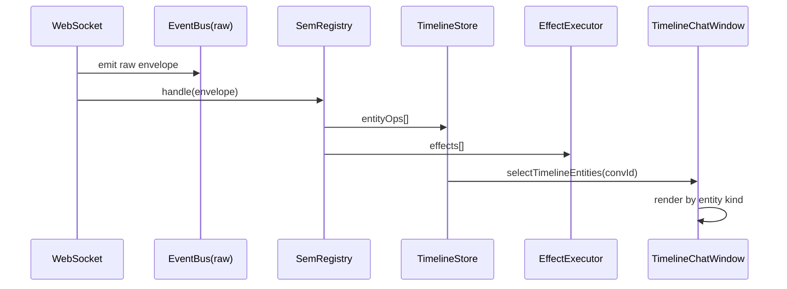
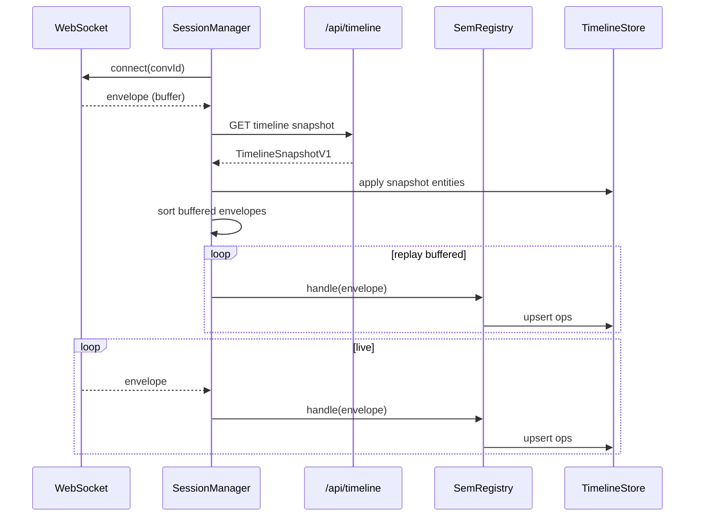

# Implementation plan: timeline-first chat runtime and projection boundaries (post-review update)

## 1. Executive Summary

This update replaces the earlier “hybrid projection plugin + transcript slice” framing with a stricter architecture that mirrors Pinocchio’s web-chat behavior.

The target is now explicit:

- every SEM frame enters one frontend projection path;
- that path emits timeline entity operations into a canonical timeline entity store;
- EventViewer remains a raw SEM sink and is not part of projection;
- HyperCard artifacts/cards are timeline entities (`tool_result` with `customKind`) rendered via entity renderers and entity actions;
- legacy synthetic timeline widget messages and panel-message reducers are removed in a hard cutover.

In short: chat UI becomes a timeline entity renderer, not a stateful message+widget composition pipeline.

## 2. What changed from the previous HC-51 draft

The expert review and Pinocchio references tighten several decisions.

Previous draft assumptions (now replaced):

1. projection plugins could remain a broad lane for transcript + inline widgets + panel models.
2. frontend could continue to project some HyperCard raw events directly as a first-class path.
3. chatSlice could potentially remain with reduced scope while adding timeline layers.

Updated direction:

1. timeline entities are the only canonical projection state for chat runtime.
2. frontend should prefer `timeline.upsert` as the canonical source for HyperCard widget/card states when backend already projects them.
3. existing `chatSlice.ts` synthetic widget-message model is removed (hard cutover).
4. EventViewer remains explicitly projection-independent.

This aligns HC-51 to `pinocchio/pkg/doc/topics/webchat-sem-and-ui.md` and `pinocchio/cmd/web-chat` implementation patterns.

## 3. Validation of expert suggestions against current code

### 3.1 Suggestion: “single SEM -> entity projection path”

Validated.

Current code in `apps/inventory/src/features/chat/InventoryChatWindow.tsx` uses a large `onSemEnvelope(...)` branch that:

- mutates transcript state via `applyLLM*` actions,
- mutates timeline widget panels via `upsertTimelineItem`,
- mutates generated card/widget panel messages,
- mutates artifacts slice,
- launches runtime side effects.

This is not a single path and duplicates semantic ownership.

Decision:

- replace with registry-driven handlers that only emit timeline entity ops (+ explicit effects).

### 3.2 Suggestion: “EventViewer should be raw-only, not projection”

Validated and already mostly true.

`emitConversationEvent(conversationId, envelope)` in `InventoryChatWindow.tsx` runs before projection and pushes raw envelope payloads to `eventBus` (`packages/engine/src/hypercard-chat/event-viewer/eventBus.ts`).

Decision:

- keep this behavior and codify it as an invariant.

### 3.3 Suggestion: “artifacts/cards should not be side-channel UI messages”

Validated.

Current artifacts are represented both as:

- `artifactsSlice` records,
- timeline widget message entries (`inventory.timeline`, `inventory.cards`, `inventory.widgets`),
- special UI renderer branches.

Decision:

- make timeline `tool_result` entities canonical;
- expose artifact actions on those entities;
- keep artifactsSlice only as an explicit derived index in phase 1 (see section 10), then optional removal.

### 3.4 Suggestion: “align transport to Pinocchio wsManager (hydrate + buffer + replay)”

Validated.

`webchatClient.ts` currently drops `seq` and `stream_id`, and `InventoryChatWindow.tsx` does its own bootstrap/hydration path.

Decision:

- move to wsManager semantics with sequence-aware replay and unified handler pipeline.

### 3.5 Suggestion: “use version safely (uint64)”

Validated.

Pinocchio transport proto defines `version` as `uint64` (`TimelineUpsertV1.version`, `TimelineSnapshotV1.version`). At runtime these values can exceed JS safe integer range.

Decision:

- store version as string (decimal) or bigint-compatible representation,
- compare via `BigInt` helper in reducers/selectors where ordering matters.

## 4. Pinocchio-aligned architecture contract for HC-51

This is the canonical contract for implementation and code review.

### 4.1 Core invariants

1. All SEM envelopes are routed through one registry entrypoint.
2. Registry handlers emit timeline entity operations; they do not mutate app-local UI state directly.
3. Timeline store is canonical runtime truth for chat timeline.
4. EventViewer consumes raw SEM envelopes and is never fed projected entities.
5. Hydration snapshots and live frames converge in the same timeline store.
6. Artifacts/cards are represented as `tool_result` entities with `props.customKind` and renderer actions.

### 4.2 Architectural flow

```text
WebSocket frame (raw envelope)
  -> emit raw envelope to EventViewer bus
  -> semRegistry.handle(envelope, ctx)
      -> [TimelineEntityOp...]
      -> [RuntimeEffect...]
  -> dispatch TimelineEntityOps to timeline store
  -> execute RuntimeEffects
  -> UI renders timeline entities with renderer registry
```

### 4.3 Hydration + replay flow

```text
connect WS
  -> buffer live envelopes until hydrated
  -> GET /api/timeline?conv_id=...
  -> apply snapshot entities to timeline store
  -> sort buffered envelopes (stream_id/seq policy)
  -> replay buffered envelopes through same semRegistry
  -> continue live processing
```

## 5. Target state model (conversation-scoped normalized timeline)

HyperCard requires multi-conversation support. We cannot keep Pinocchio’s single conversation shape unchanged.

### 5.1 Proposed state shape

```ts
type TimelineEntity = {
  id: string;
  kind: string;
  createdAt: number;
  updatedAt?: number;
  version?: string; // decimal uint64 string
  props: Record<string, unknown>;
};

type ConversationTimeline = {
  byId: Record<string, TimelineEntity>;
  order: string[];
  // optional indexes for faster selectors
  kindOrder?: Record<string, string[]>;
  // latest seen transport ordering
  lastSeq?: string;
  lastStreamId?: string;
};

type TimelineState = {
  conversations: Record<string, ConversationTimeline>;
};
```

### 5.2 Version comparator

```ts
function isIncomingVersionNewer(incoming?: string, existing?: string): boolean {
  if (!incoming) return false;
  if (!existing) return true;
  try {
    return BigInt(incoming) > BigInt(existing);
  } catch {
    // malformed incoming version should not block update path,
    // but should be logged in dev mode.
    return true;
  }
}
```

### 5.3 Operation contracts

```ts
type TimelineEntityOp =
  | { type: 'add'; convId: string; entity: TimelineEntity }
  | { type: 'upsert'; convId: string; entity: TimelineEntity }
  | { type: 'rekey'; convId: string; fromId: string; toId: string }
  | { type: 'clearConversation'; convId: string };
```

## 6. SEM envelope and registry contracts (updated)

### 6.1 Envelope type must retain ordering metadata

Current `SemEventEnvelope` in `apps/inventory/src/features/chat/webchatClient.ts` and `packages/engine/src/hypercard-chat/types.ts` omits `seq` and `stream_id`.

New envelope contract:

```ts
type SemEventEnvelope = {
  sem?: boolean;
  event?: {
    type?: string;
    id?: string;
    data?: Record<string, unknown>;
    metadata?: Record<string, unknown>;
    seq?: number | string;
    stream_id?: string;
  };
};
```

### 6.2 Registry contract

```ts
type SemContext = {
  convId: string;
  now: () => number;
};

type RuntimeEffect =
  | { type: 'eventBus.emitRaw'; convId: string; envelope: SemEventEnvelope }
  | { type: 'artifact.open'; artifactId: string; title?: string; template?: string }
  | { type: 'runtimeCard.register'; cardId: string; code: string }
  | { type: 'runtimeCard.openEditor'; cardId: string; code: string };

type SemHandlerResult = {
  entityOps: TimelineEntityOp[];
  effects: RuntimeEffect[];
};

type SemHandler = (envelope: SemEventEnvelope, ctx: SemContext) => SemHandlerResult;
```

### 6.3 Handler families

Required handler families for parity:

- `timeline.upsert` (canonical projector feed)
- `llm.start`, `llm.delta`, `llm.final`
- `llm.thinking.start`, `llm.thinking.delta`, `llm.thinking.final`
- `tool.start`, `tool.delta`, `tool.result`, `tool.done`
- `log`
- `ws.error`

Optional HyperCard raw handlers:

- `hypercard.widget.*`, `hypercard.card.*`, `hypercard.suggestions.*`

Policy decision for HC-51:

- default to strict canonical mode: rely on `timeline.upsert` for hypercard widget/card entity creation;
- only keep frontend raw handlers when backend projector cannot yet express that event in timeline.

## 7. Backend/frontend mirror constraints

Backend already registers timeline handlers for HyperCard events in `go-inventory-chat/internal/pinoweb/hypercard_events.go`:

- status projections for `hypercard.widget.start/update/error` and `hypercard.card.start/update/error` -> `kind=status`, `id=ev.id + ":status"`.
- result projections for `hypercard.widget.v1`, `hypercard.card.v2` -> `kind=tool_result`, `id=ev.id + ":result"`, `customKind` set.

This means frontend can trust `timeline.upsert` as durable canonical feed for these entities.

### 7.1 Mirror rule

For any event type with a backend `RegisterTimelineHandler(...)` mapping, frontend should avoid re-projecting raw event semantics into independent entity ids.

### 7.2 Implication

Remove frontend lifecycle synthesis code paths based on `formatHypercardLifecycle(...)` + synthetic timeline widget rows as primary representation.

## 8. UI architecture after cutover

### 8.1 Shift from “ChatWindow + synthetic widget messages” to “entity timeline renderer”

Current state:

- `ChatWindow` receives `messages` with inline widget blocks from reducer,
- `chatSlice` fabricates timeline panel message ids per round.

Target:

- introduce entity-first chat timeline UI (`TimelineChatWindow` concept),
- render one or more UI cards per timeline entity kind,
- preserve composer UX and header/footer controls.

### 8.2 Renderer registry

```ts
type EntityRenderer = (entity: TimelineEntity, ctx: RenderContext) => React.ReactNode;

type EntityRendererRegistry = {
  message: EntityRenderer;
  tool_call: EntityRenderer;
  tool_result: EntityRenderer;
  status: EntityRenderer;
  log: EntityRenderer;
  default: EntityRenderer;
  [kind: string]: EntityRenderer;
};
```

### 8.3 HyperCard-specific renderers

For `tool_result` entities with `props.customKind`:

- `hypercard.widget.v1` renderer:
  - parse `props.result` payload,
  - display title/template/artifact summary,
  - action: open artifact.

- `hypercard.card.v2` renderer:
  - parse payload and embedded card metadata,
  - action: register runtime card + open artifact,
  - action: open code editor when code available.

### 8.4 Pseudocode: tool_result renderer action path

```ts
function onOpenHypercardResult(entity: TimelineEntity, dispatch: AppDispatch, getState: () => RootState) {
  const parsed = parseHypercardResult(entity.props.result);
  if (!parsed?.artifactId) return;

  if (parsed.runtimeCardId && parsed.runtimeCardCode) {
    registerRuntimeCard(parsed.runtimeCardId, parsed.runtimeCardCode);
  }

  const payload = buildArtifactOpenWindowPayload({
    artifactId: parsed.artifactId,
    template: parsed.template,
    title: parsed.title,
    runtimeCardId: parsed.runtimeCardId,
  });

  if (payload) dispatch(openWindow(payload));
}
```

## 9. EventViewer contract (explicitly outside projection)

No architectural change to the fundamental contract.

Hard rule:

- event viewer bus receives raw envelopes before registry projection.

Checklist:

- keep `emitConversationEvent(convId, envelope)` at transport ingress;
- never emit projected entity ops into this bus;
- optionally add a second debug channel for entity ops if needed, but keep it distinct from raw SEM view.

## 10. Artifact state strategy (canonical + derived index)

The review surfaced an important integration constraint: inventory plugin runtime currently reads from `domains.artifacts` (`apps/inventory/src/domain/pluginBundle.vm.js`).

### 10.1 Decision for HC-51

Use two-layer strategy:

- canonical truth: timeline entities (`tool_result` etc),
- derived index: `artifactsSlice` maintained from timeline entity updates.

This is allowed because `artifactsSlice` is explicitly derived, not a competing source of truth.

### 10.2 Why this choice now

Pros:

- preserves plugin behavior and window workflows,
- reduces blast radius for HC-51,
- allows hard cutover away from synthetic chat widget messages without simultaneously rewriting plugin bundle domain access.

Cons:

- temporary duplication between timeline entities and artifacts index.

### 10.3 Follow-up (post HC-51)

Optionally migrate plugin runtime to read artifacts directly from timeline domain and remove `artifactsSlice`.

## 11. Transport/hydration implementation aligned with Pinocchio wsManager

### 11.1 Required behavior

- connect websocket with conv id;
- hydrate from `/api/timeline?conv_id=...`;
- buffer incoming frames before hydration complete;
- replay buffered frames in deterministic order;
- apply all frames through registry path.

### 11.2 Ordering policy

Priority:

1. if `stream_id` exists and can be lexicographically ordered safely, prefer it,
2. else fallback to `seq`,
3. else preserve receive order.

### 11.3 Session pseudocode

```ts
function startConversationSession(convId: string, deps: SessionDeps) {
  const state = {
    hydrated: false,
    buffer: [] as SemEventEnvelope[],
  };

  const onEnvelope = (envelope: SemEventEnvelope) => {
    deps.emitRawEvent(convId, envelope);

    if (!state.hydrated) {
      state.buffer.push(envelope);
      return;
    }

    applyEnvelope(envelope);
  };

  const applyEnvelope = (envelope: SemEventEnvelope) => {
    const result = deps.semRegistry.handle(envelope, { convId, now: Date.now });
    deps.dispatch(applyTimelineOps(result.entityOps));
    for (const fx of result.effects) deps.effectExecutor(fx);
  };

  const hydrate = async () => {
    deps.dispatch(clearConversationTimeline({ convId }));
    const snapshot = await deps.fetchTimelineSnapshot(convId);
    deps.dispatch(applyTimelineSnapshot({ convId, snapshot }));

    state.hydrated = true;

    const replay = sortBuffered(state.buffer);
    state.buffer = [];
    for (const env of replay) applyEnvelope(env);
  };

  return { onEnvelope, hydrate };
}
```

## 12. Detailed cutover scope (hard cutover)

### 12.1 Remove legacy reducer patterns

Primary deletions/refactors in `apps/inventory/src/features/chat/chatSlice.ts`:

- `timelineWidgetMessageId`, `cardPanelMessageId`, `widgetPanelMessageId` helpers,
- `ensureTimelineWidgetMessage`, `ensureCardPanelMessage`, `ensureWidgetPanelMessage`,
- `upsertTimelineItem`, `upsertCardPanelItem`, `upsertWidgetPanelItem`,
- round-based synthetic timeline widget message behavior.

### 12.2 Replace orchestration in InventoryChatWindow

`apps/inventory/src/features/chat/InventoryChatWindow.tsx` should be reduced to:

- session wiring (`useConversationSession` / wsManager connect),
- selecting entities and render model,
- sending prompts,
- opening EventViewer/debug controls.

Move out:

- giant `onSemEnvelope` conditional chain,
- ad-hoc hydration formatting path,
- timeline widget-specific rendering branches.

### 12.3 Engine cleanup targets

Legacy widget components to remove or repurpose:

- `packages/engine/src/hypercard-chat/widgets/TimelineWidget.tsx`
- `packages/engine/src/hypercard-chat/widgets/ArtifactPanelWidgets.tsx`

If retained, they must be redefined as entity renderers, not consumers of separate timeline widget models.

## 13. Revised workstreams

### Workstream A: timeline core + types

Deliverables:

- add conversation-scoped timeline slice in engine;
- add safe version comparator using string/bigint;
- add selectors for ordered entities per conversation.

Target files:

- `packages/engine/src/hypercard-chat/timeline/timelineSlice.ts`
- `packages/engine/src/hypercard-chat/timeline/selectors.ts`
- `packages/engine/src/hypercard-chat/timeline/version.ts`

Acceptance:

- supports multi-conversation timeline entity updates,
- entity upsert semantics stable under out-of-order versioned updates.

### Workstream B: sem registry + mapper

Deliverables:

- registry patterned after Pinocchio `registry.ts`;
- mapper for timeline proto snapshots to entities (adapted to convId);
- handler family tests with fixture envelopes.

Target files:

- `packages/engine/src/hypercard-chat/sem/registry.ts`
- `packages/engine/src/hypercard-chat/sem/timelineMapper.ts`
- `packages/engine/src/hypercard-chat/sem/handlers/*.ts`

Acceptance:

- no direct UI reducer writes in handlers,
- all handler outputs expressed as entity ops + effects.

### Workstream C: ws manager cutover

Deliverables:

- ws manager with hydrate/buffer/replay policy,
- envelope type retains `seq` and `stream_id`,
- snapshot + live envelopes applied through same registry path.

Target files:

- `apps/inventory/src/features/chat/webchatClient.ts` (replace or retire)
- `apps/inventory/src/features/chat/useConversationSession.ts` (new)
- `apps/inventory/src/features/chat/InventoryChatWindow.tsx` (consumer)

Acceptance:

- no pre-registry special routing,
- event viewer still sees all envelopes.

### Workstream D: entity-first renderer

Deliverables:

- timeline entity renderer registry,
- hypercard `tool_result` custom renderer actions (open/edit),
- preserve existing UX signals (streaming, status, errors).

Target files:

- `packages/engine/src/hypercard-chat/ui/TimelineChatWindow.tsx` (new)
- `apps/inventory/src/features/chat/InventoryChatWindow.tsx` (wire-up)
- `packages/engine/src/hypercard-chat/artifacts/artifactRuntime.ts` (reuse actions)

Acceptance:

- chat renders from timeline entities directly,
- no synthetic timeline panel messages.

### Workstream E: derived artifact index + plugin compatibility

Deliverables:

- derive `artifactsSlice` updates from timeline entity upserts (`tool_result` custom kinds),
- keep plugin bundle functional without changing runtime API in HC-51.

Target files:

- `packages/engine/src/hypercard-chat/artifacts/artifactsSlice.ts`
- `packages/engine/src/hypercard-chat/artifacts/artifactRuntime.ts`
- `apps/inventory/src/domain/pluginBundle.vm.js` (no change expected in HC-51).

Acceptance:

- artifact windows still open,
- plugin cards still resolve artifacts via `domains.artifacts`.

### Workstream F: hard cutover cleanup + docs/tests

Deliverables:

- remove legacy synthetic timeline widget reducers/components,
- update stories/tests to entity-first architecture,
- finalize docs and runtime diagnostics notes.

Target files:

- `apps/inventory/src/features/chat/chatSlice.ts` (major simplification or replacement)
- `apps/inventory/src/features/chat/stories/*` (re-baseline)
- `packages/engine/src/hypercard-chat/widgets/*` (remove/repurpose)

Acceptance:

- no dead legacy path,
- tests pass with entity-first model.

## 14. Pseudocode: strict canonical handling modes

### 14.1 Mode A (recommended): strict backend-canonical for HyperCard custom events

```ts
register('hypercard.widget.start', noop);
register('hypercard.widget.update', noop);
register('hypercard.widget.v1', noop);
register('hypercard.card.start', noop);
register('hypercard.card.update', noop);
register('hypercard.card.v2', noop);

register('timeline.upsert', (env, ctx) => {
  const pb = decodeTimelineUpsert(env.event?.data);
  if (!pb?.entity) return empty();
  return {
    entityOps: [{ type: 'upsert', convId: ctx.convId, entity: mapTimelineEntity(pb.entity, pb.version) }],
    effects: [deriveArtifactEffectIfNeeded(pb.entity)],
  };
});
```

### 14.2 Mode B (fallback): optimistic frontend projection for missing backend handlers

```ts
register('hypercard.widget.v1', (env, ctx) => {
  // only used if backend timeline.upsert for this event is unavailable
  const parsed = parseHypercardWidget(env.event?.data);
  if (!parsed) return empty();
  return {
    entityOps: [{
      type: 'upsert',
      convId: ctx.convId,
      entity: {
        id: `${env.event?.id}:result`,
        kind: 'tool_result',
        createdAt: ctx.now(),
        props: { customKind: 'hypercard.widget.v1', result: JSON.stringify(parsed.raw) },
      },
    }],
    effects: [],
  };
});
```

HC-51 default is Mode A.

## 15. Sequence and timeline diagrams

### 15.1 End-to-end live frame path



### 15.2 Hydration + buffer replay



### 15.3 Entity lifecycle example (HyperCard card)

```text
t0  hypercard.card.start frame arrives
    -> backend projects status entity id=<id>:status
    -> frontend receives timeline.upsert(status)

t1  hypercard.card.update frame arrives
    -> backend updates status entity
    -> frontend receives timeline.upsert(status)

t2  hypercard.card.v2 frame arrives
    -> backend projects tool_result id=<id>:result customKind=hypercard.card.v2
    -> frontend receives timeline.upsert(tool_result)
    -> renderer shows card ready action buttons (open/edit)
```

## 16. Testing and validation plan

### 16.1 Unit tests

- timeline reducer version handling with >53-bit version strings,
- sem handlers for llm/tool/timeline/upsert families,
- mapper tests for `TimelineEntityV1` oneof decoding,
- artifact extraction from `tool_result` entity props.

### 16.2 Integration tests

- hydrate then replay buffered live frames,
- llm streaming sequence convergence,
- hypercard card/widget projected via `timeline.upsert`,
- event viewer receives raw envelopes regardless of projection result.

### 16.3 Regression tests for removed legacy behavior

Replace existing tests tied to synthetic widget messages:

- `chatSlice.test.ts` cases around `timeline-widget-message-r*`,
- per-round timeline widget story assumptions.

New checks:

- entity ordering and rendering snapshots,
- renderer action flows for `hypercard.card.v2` and `hypercard.widget.v1`.

## 17. Risk register

### Risk 1: temporary behavior gaps during hard cutover

Mitigation:

- maintain focused parity fixture suites from real SEM/timeline logs;
- phase cutover by swapping read path first, then deleting write path.

### Risk 2: version compare bugs from bigint/string handling

Mitigation:

- unit tests with explicit boundary values (`2^53-1`, `2^63`, near-1e18);
- centralize comparator utility.

### Risk 3: plugin runtime dependency on artifacts slice

Mitigation:

- keep derived artifacts index in HC-51;
- document as transitional and mark follow-up ticket for timeline-domain plugin access.

### Risk 4: team confusion from terminology overlap (widget)

Mitigation:

- enforce naming in code:
  - `TimelineEntity` (canonical),
  - `EntityRenderer` (UI),
  - `ArtifactIndex` (derived cache).

## 18. Implementation checklist (developer-ready)

1. Add timeline core slice + selectors with convId partitioning.
2. Add sem envelope types with `seq`/`stream_id` retained.
3. Implement registry + default handlers patterned on Pinocchio.
4. Implement ws session manager with hydrate/buffer/replay.
5. Add entity-first chat timeline UI and renderer registry.
6. Wire artifact open/edit actions on `tool_result` custom kinds.
7. Keep EventViewer raw event path unchanged.
8. Derive artifacts slice from timeline entities.
9. Remove `chatSlice` synthetic timeline widget machinery.
10. Remove/repurpose legacy timeline widget components/stories.
11. Add tests for version safety, projection parity, and event viewer behavior.
12. Update docs/changelog/stories to reflect cutover architecture.

## 19. Explicit non-goals for HC-51

- No backwards compatibility path for old chat reducer widget-message model.
- No dual-runtime feature flag.
- No full plugin runtime domain contract rewrite in the same ticket.

## 20. Conclusion

After incorporating expert feedback and validating against Pinocchio docs/source plus current HyperCard code, the correct HC-51 trajectory is a strict timeline-first cutover with one SEM projection path and raw EventViewer separation.

This plan intentionally narrows architecture choices to reduce long-term ambiguity:

- timeline entities are the runtime truth,
- renderer actions handle artifact/card behaviors,
- legacy synthetic message projections are removed,
- backend/frontend projection semantics are mirrored.

This keeps HyperCard aligned with Pinocchio and makes future subsystem extraction and reuse substantially cleaner.

## References

- `ttmp/2026/02/17/HC-51-TIMELINE-FIRST-CHAT--timeline-first-chat-runtime-with-app-specific-widget-card-projections/sources/local/01-hc-51-update.md`
- `/home/manuel/workspaces/2026-02-14/hypercard-add-webchat/pinocchio/pkg/doc/topics/webchat-sem-and-ui.md`
- `/home/manuel/workspaces/2026-02-14/hypercard-add-webchat/pinocchio/cmd/web-chat/web/src/sem/registry.ts`
- `/home/manuel/workspaces/2026-02-14/hypercard-add-webchat/pinocchio/cmd/web-chat/web/src/sem/timelineMapper.ts`
- `/home/manuel/workspaces/2026-02-14/hypercard-add-webchat/pinocchio/cmd/web-chat/web/src/ws/wsManager.ts`
- `/home/manuel/workspaces/2026-02-14/hypercard-add-webchat/pinocchio/proto/sem/timeline/transport.proto`
- `apps/inventory/src/features/chat/InventoryChatWindow.tsx`
- `apps/inventory/src/features/chat/chatSlice.ts`
- `apps/inventory/src/features/chat/webchatClient.ts`
- `packages/engine/src/hypercard-chat/artifacts/timelineProjection.ts`
- `packages/engine/src/hypercard-chat/artifacts/artifactRuntime.ts`
- `packages/engine/src/hypercard-chat/artifacts/artifactsSlice.ts`
- `packages/engine/src/hypercard-chat/event-viewer/eventBus.ts`
- `go-inventory-chat/internal/pinoweb/hypercard_events.go`
